# **Takım İsmi**

Takım 48

# Ürün İle İlgili Bilgiler

## Takım Elemanları

- Samet Özkök: Product Owner ([LinkedIn](https://www.linkedin.com/in/sametozkok) | [GitHub](https://github.com/sametozkok))
- Betül Danışmaz: Scrum Master ([LinkedIn](https://www.linkedin.com/in/betuldanismaz) | [GitHub](https://github.com/betuldanismaz))
- Fırat Kaan Çıkar: Team Member/Developer ([LinkedIn](https://www.linkedin.com/in/fkaancikar) | [GitHub](https://github.com/fkaanc))
- Selma Bener: Team Member/Developer ([LinkedIn](https://www.linkedin.com/in/selma-bener-a28924251?utm_source=share_via&utm_content=profile&utm_medium=member_ios) | [GitHub](https://github.com/selmaabe))
- Ahmet Yasir Duman: Team Member/Developer ([LinkedIn](www.linkedin.com/in/ahmetyasirduman) | [GitHub](https://github.com/ahmetduman23))

## Ürün İsmi

--AquaSentinel AI--

## Ürün Açıklaması

- AquaSentinel AI, Marmara Denizi'ndeki müsilaj oluşumunu yapay zeka ve uydu verileriyle erken tespit eden bir uyarı sistemidir. Deniz yüzeyi sıcaklığı (SST) ve klorofil-a verilerini otomatik olarak toplayıp analiz ederek risk tahmini yapar ve yetkilileri uyarır.

## Ürün Özellikleri

- Sentinel-3 uydu verilerini otomatik indirme (CDSE API)
- Bulut, kara ve hatalı veri maskeleme (Kalite Kontrol)
- Klorofil-a ve Deniz Yüzeyi Sıcaklığı (SST) zaman serisi verisi oluşturma
- Otomatik trend analizi grafikleri üretme

## Hedef Kitle

- Çevre, Şehircilik ve İklim Değişikliği Bakanlığı
- Belediyelerin çevre ve denizcilik birimleri
- Denizcilik ve balıkçılık sektörü
- Deniz bilimleri araştırmacıları ve akademisyenler

## 🔗 Proje Bağlantıları (Live Links)

> [!IMPORTANT]
> 🌐 **CANLI UYGULAMA DEMO (VERCEL)**: [https://yzta-bootcamp-grup-48.vercel.app/](https://yzta-bootcamp-grup-48.vercel.app/)

> [!NOTE]
> 📋 **PRODUCT BACKLOG (MIRO BOARD)**: [https://miro.com/app/board/uXjVH7tYdQM=/](https://miro.com/app/board/uXjVH7tYdQM=/?share_link_id=616030223380)

---

# Sprint 1

- **Backlog düzeni ve Story seçimleri**: Backlog'umuz öncelikli işlere göre sıralanmıştır. Story'ler, sprint kapasitesini aşmayacak şekilde seçilmiş ve daha küçük alt görevlere (task) bölünmüştür. Miro panosunda mavi kartlar story'leri, turuncu kartlar ise görevleri temsil eder.

    - **Puanlama Mantığı**: Sprint 1 toplam eforu 19 SP (Story Point) olarak planlanıp tamamlanmıştır. Puanlar iş yüküne göre verilmiştir:
        - Yüksek eforlu işler (CDSE API entegrasyonu, veri ön işleme): **5'er SP**
        - Temel kurulum ve test işleri (Proje yapısı, Base Agent, birim testleri): **3'er SP**

    - **Reddedilen İşler (Rejected Backlog)**:
        - **Sentinel-2 Verisi**: Bulutluluk oranı yüksek olduğu için yerine Sentinel-3 tercih edildi.
        - **SQL Veritabanı**: İlk aşamada sistemin hafif ve hızlı olması için SQL yerine doğrudan `.csv` dosyaları kullanıldı.

    - **Sprint 1 Hedefi**: Marmara Denizi için Sentinel-3 uydu verilerini otomatik indiren, hatalı ve bulutlu pikselleri temizleyen ve zaman serisi veri seti oluşturan altyapının kurulması.

    - **Sprint 1 User Stories**:
        - **US-101 (3 SP)**: Modüler proje klasör yapısının (`src/`, `tests/`) kurulması. (✅ Done)
        - **US-102 (5 SP)**: Sentinel-3 uydu verisi indirme modülünün geliştirilmesi. (✅ Done)
        - **US-103 (5 SP)**: Bulut/kara maskeleme ve veri temizleme modülünün yazılması. (✅ Done)
        - **US-104 (3 SP)**: AI Agent temel (Base Agent) sınıfının oluşturulması. (✅ Done)
        - **US-105 (3 SP)**: Veri akışı için en az 39 adet birim testinin yazılması. (✅ Done)

- **Sprint Backlog Tablosu**: 

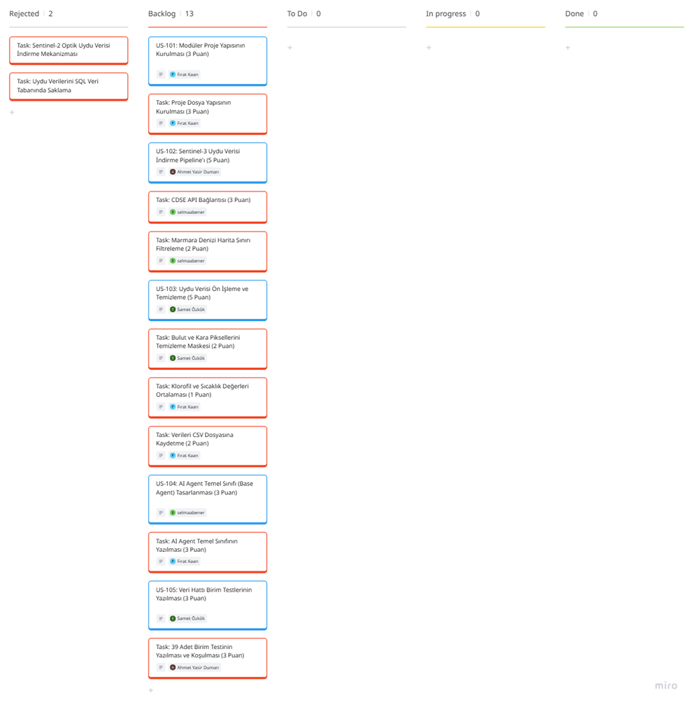

- **Daily Scrum**: Mezuniyet, bitirme projesi ve staj yoğunlukları nedeniyle görüşmelerimiz WhatsApp üzerinden yazılı olarak yapılmıştır. 

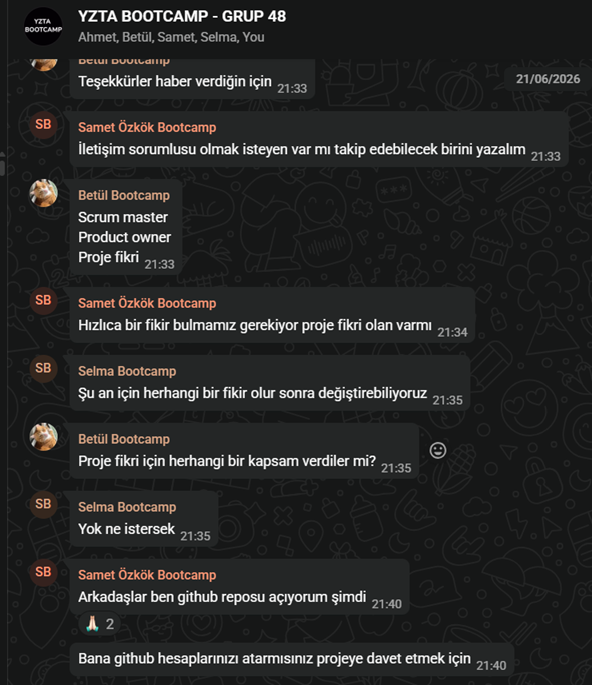

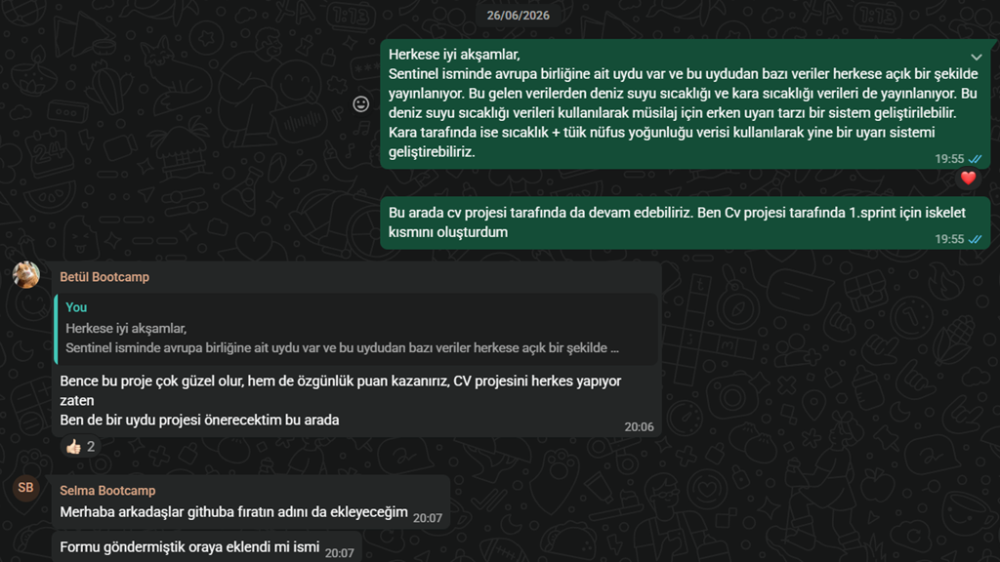

- **Sprint Board Update**: Sprint 1 sonundaki tüm görevlerin tamamlandığını gösteren panomuz:

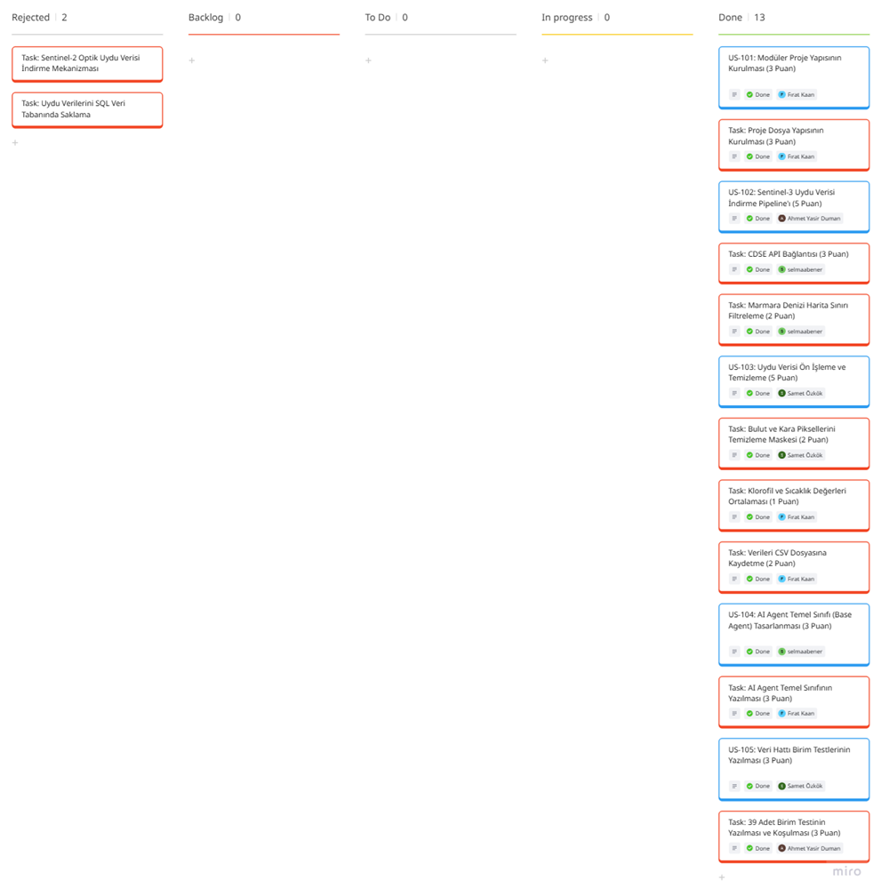

- **Ürün Durumu**: Sentinel-3 verilerini otomatik indiren veri akışı kuruldu. Ham veriler bulut ve karadan temizlenerek `marmara_time_series.csv` dosyasına kaydedildi. Ayrıca `src/visualization.py` ile bu verilerin otomatik trend grafiği üretildi.

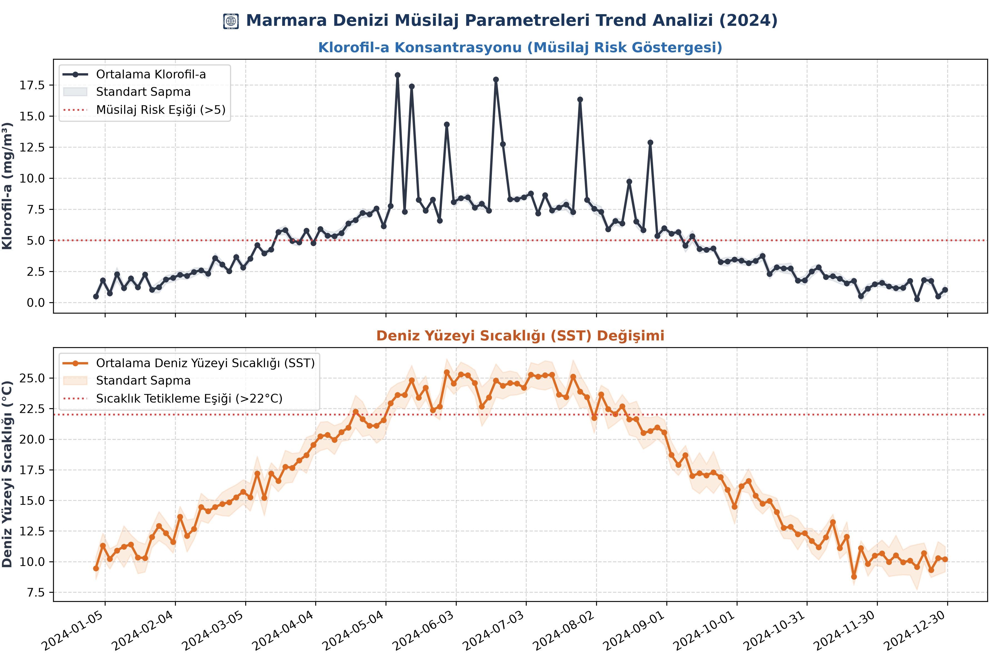

- **Sprint Review**: Veri indirme, maskeleme, temizleme modülleri ile AI Agent iskelet yapısının çalıştığı doğrulandı. Hazırlanan zaman serisi veri setinin Sprint 2'de eğitilecek yapay zeka modeline beslenmesine karar verildi.

- **Sprint Retrospective**: Yoğun takvimimize rağmen hedeflerimize ulaştık. API indirme süreci yavaş olduğundan sahte (mock) veri modu ekleyerek testleri hızlandırdık. Gelecek sprintte işleri zamana daha dengeli yaymayı ve haftada 1-2 kez kısa canlı toplantı yapmayı kararlaştırdık.

---

# Sprint 2

- **Backlog düzeni ve Story seçimleri**: Sprint 2 kapsamında yapay zeka modelinin eğitilmesi, AI Agent mimarisinin (veri analizi, risk tahmini ve raporlama ajanları) kurulması ve orkestrasyonu hedeflenmiştir. 
  - **Toplam Planlanan Efor**: 24 SP (Story Point)
  - **Seçilen Kullanıcı Hikayeleri (User Stories)**:
    - **US-201 (8 SP)**: Sıcaklık artış hızı (SST gradyanı) ve klorofil yoğunluğuna göre "Müsilaj Risk Endeksi" hesaplayan makine öğrenmesi modelinin eğitilmesi ve kaydedilmesi. (Alt Görevler: Veri setinin hazırlanması (2 SP), korelasyon analizleri (2 SP) ve biyolojik eşiklerin belirlenmesi (2 SP)).
    - **US-202 (5 SP)**: `DataAnalysisAgent` ve `MucilageRiskAgent` kurgulanması, hafıza (memory) ve veri analiz araçlarının (tools) entegrasyonu.
    - **US-203 (5 SP)**: Gemini API ve çevrimdışı şablon destekli çalışan, detaylı risk raporları üreten `ReportingAgent` entegrasyonu.
    - **US-204 (3 SP)**: Birim ve entegrasyon testlerinin (`tests/test_model.py`, `tests/test_agents.py`) yazılması ve doğrulanması.
    - **US-205 (3 SP)**: Reponun temiz kod mimarisine göre refaktör edilmesi ve orkestrasyon betiğinin (`run_sprint2.py`) hazırlanması.

- **Sprint Backlog Tablosu**: 

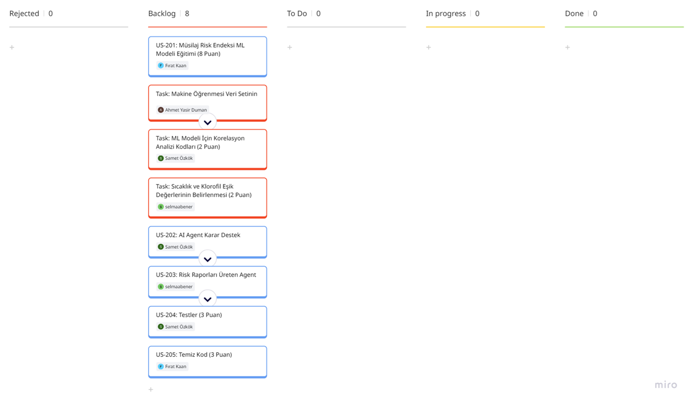

- **Daily Scrum**: Sprint 2 boyunca gerçekleştirilen toplantılar ve planlanması:

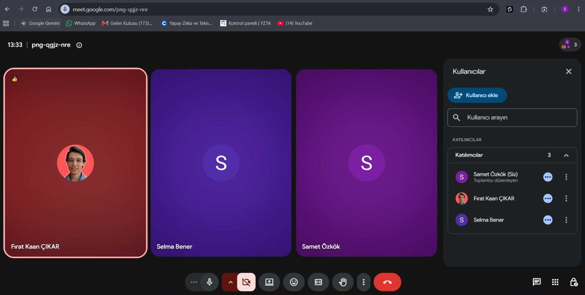

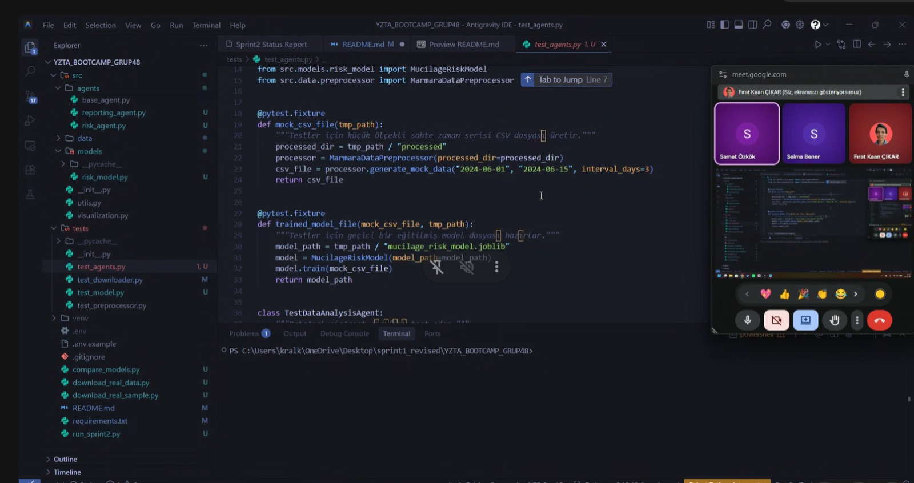

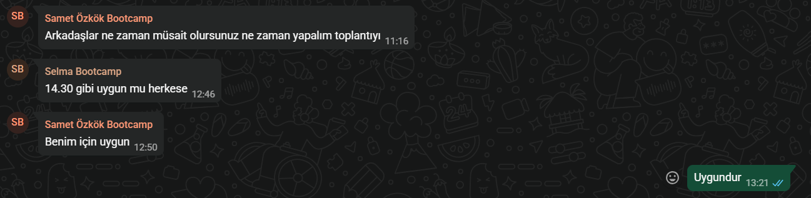

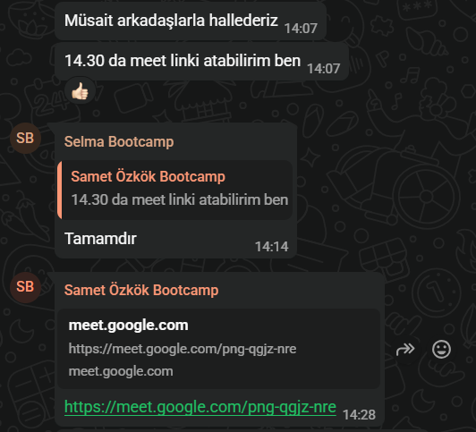

---

- **Sprint Board Update**: Sprint 2 sonundaki Miro Backlog panomuzun güncel görünümü:

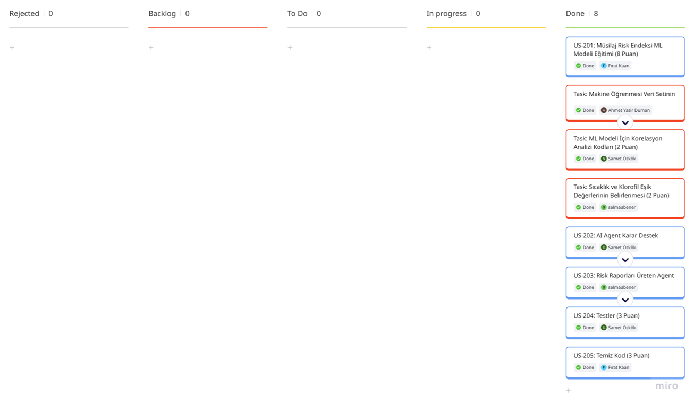

---

- **Ürün Durumu**: Random Forest Classifier kullanılarak eğitilen müsilaj risk modeli **%99.04 doğruluk** oranına ulaşmıştır. Modelin en önemli girdisi Deniz Yüzeyi Sıcaklığı (%48.29) ve klorofil artış hızıdır. `DataAnalysisAgent`, `MucilageRiskAgent` ve `ReportingAgent` başarıyla orkestre edilmiştir.

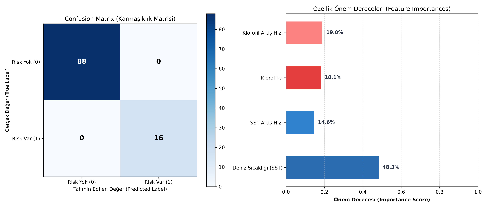

- **Sprint Review**:
    - ML modeli (%99.04 accuracy) ve 3 ajanın (Analiz, Risk, Raporlama) tam orkestrasyonu tamamlandı.
    - Sprint 3'te CBS (GIS) harita paneli ve web arayüzü entegrasyonuna karar verildi.

- **Sprint Retrospective**:
    - **İyi Gitti**: Model ve ajan yapıları hızla kuruldu; Gemini API fallback mekanizması sistemi sağlamlaştırdı.
    - **Geliştirilebilir**: API kurulum süreci daha erken planlanabilirdi; test kapsamı paralelde artırılmalı.
    - **Aksiyon**: Web dashboard taslağı ve ajan entegrasyon API'leri Sprint 3'e taşındı.

---

# Sprint 3

- **Backlog düzeni ve Story seçimleri**: Sprint 3 kapsamında harita tabanlı (GIS) web arayüzünün (dashboard) canlıya alınması, AI Agent mimarisi ile makine öğrenmesi tahmin modelinin entegre edilmesi, kod tabanının Clean Code prensiplerine göre refaktör edilmesi ve ürün teslim süreçlerinin tamamlanması hedeflenmiştir.
  - **Toplam Planlanan Efor**: 18 SP (Story Point)
  - **Seçilen Kullanıcı Hikayeleri (User Stories)**:
    - **US-301 (6 SP)**: Harita Tabanlı (GIS) Web Dashboard Tasarımı — Leaflet.js ve Chart.js altyapısıyla bölge seçimli, katman kontrollü ve zaman serisi simülasyonlu arayüzün geliştirilmesi. (✅ Done)
    - **US-302 (5 SP)**: Dashboard ve AI Agent Entegrasyonu — AI Agent (`DataAnalysisAgent`, `MucilageRiskAgent`, `ReportingAgent`) tahmin ve raporlama çıktılarının web arayüzüne (`predictions.json` ve canlı AI Agent analiz günlüğü) entegre edilmesi. (✅ Done)
    - **US-303 (4 SP)**: Temiz Kod Refaktörü — Proje kod tabanının Clean Code prensiplerine göre refaktör edilmesi, merkezi loglama ve tip belirteçlerinin (type hints) tamamlanması. (✅ Done)
    - **US-304 (3 SP)**: Vercel ile Projeyi Canlıya Alma — Vercel / GitHub Pages canlı dağıtım altyapısının (`vercel.json`, kök `index.html`) yapılandırılması ve yayınlanması. (✅ Done)

  - **Sprint 3 Hedefi**: Makine öğrenmesi risk modelini ve AI Agent mimarisini harita tabanlı GIS web arayüzünde canlıya almak, kullanıcıların Marmara Denizi müsilaj riskini etkileşimli olarak izlemesini ve raporlamasını sağlamak.

- **Sprint Backlog Tablosu**: 

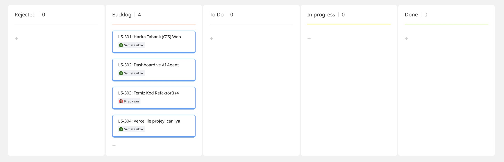

- **Daily Scrum**: Sprint 3 boyunca ekip içi iletişim ve günlük takip yazılı olarak ve online değerlendirme toplantılarıyla yürütülmüştür:

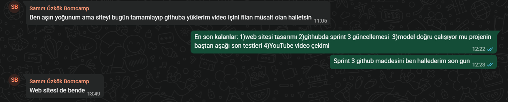

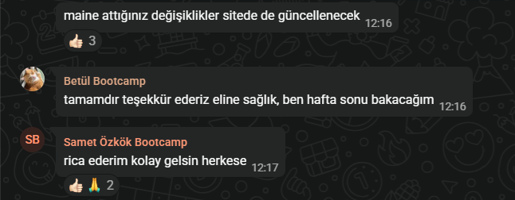

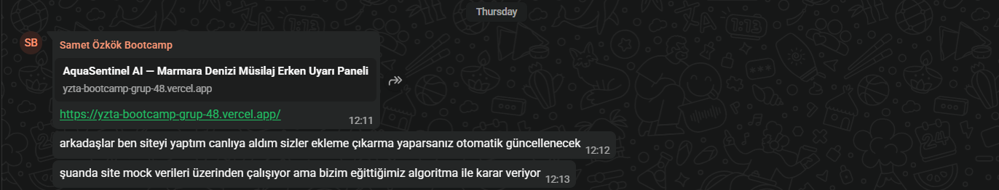

---

- **Sprint Board Update**: Sprint 3 sonundaki tüm görevlerin tamamlandığını gösteren güncel Miro panomuz:

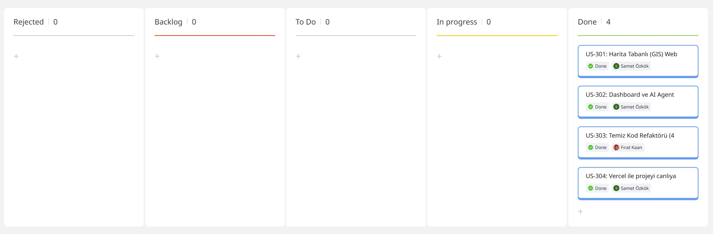

---

- **Ürün Durumu**: Leaflet.js altyapılı harita tabanlı (GIS) Web Dashboard geliştirildi, AI Agent ve makine öğrenmesi tahmin modelleri zaman serisi verileriyle entegre edildi. Proje Vercel altyapısı üzerinde canlıya alındı. (🌐 [https://yzta-bootcamp-grup-48.vercel.app/](https://yzta-bootcamp-grup-48.vercel.app/))

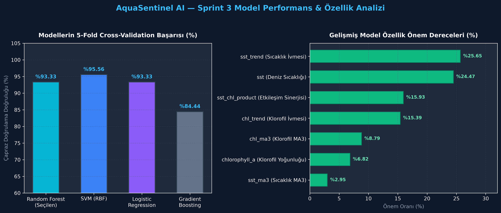

- **Model Seçimi ve İyileştirmeler**:
  - **Random Forest Tercihi**: Yüksek açıklanabilirlik (özellik önem düzeyleri) ve uydu gürültüsüne karşı kararlılığı nedeniyle seçilmiştir.
  - **Gelişmiş Özellikler**: Sıcaklık-Klorofil etkileşimi ve hareketli ortalamalar eklenerek 7 özelliğe çıkarılmıştır.
  - **Doğrulanmış Başarım**: 5-Fold Cross-Validation ile **%93.33 doğruluk** elde edilmiştir.

- **Sprint Review**:
    - 90 adet gerçek Sentinel-3 NetCDF uydu verisi işlendi, gelişmiş ML modeli (GridSearch + Olasılık Kalibrasyonu) eğitilerek %93.33 5-Fold Cross-Validation doğruluğu doğrulandı.
    - AI Agent ve ML tahmin modelinin web dashboard ile orkestrasyonu eksiksiz tamamlandı.
    - Kod tabanı Clean Code standartlarında refaktör edildi, tip belirteçleri ve merkezi loglama güçlendirildi.
    - Vercel üzerinde canlı web uygulaması yayına alındı.
    - 3 dakikalık YouTube proje tanıtım videosu ve ürün teslim formu hazırlandı.

- **Sprint Retrospective**:
    - **İyi Gitti**: Frontend GIS arayüzü ve AI Agent günlüğü entegrasyonu görsel açıdan çok tatmin edici ve hızlı çalışır hale geldi. Vercel deployment sorunsuz gerçekleşti.
    - **Geliştirilebilir**: Harita üzerindeki veri noktası (grid) çözünürlüğü gelecekte Sentinel-2 verileri ile mikro ölçeğe indirgenebilir.
    - **Aksiyon**: Bootcamp sonrası projenin açık kaynak topluluğuna sunulması ve Çevre Bakanlığı/Belediye yetkilileri ile demo görüşmelerinin planlanması.

