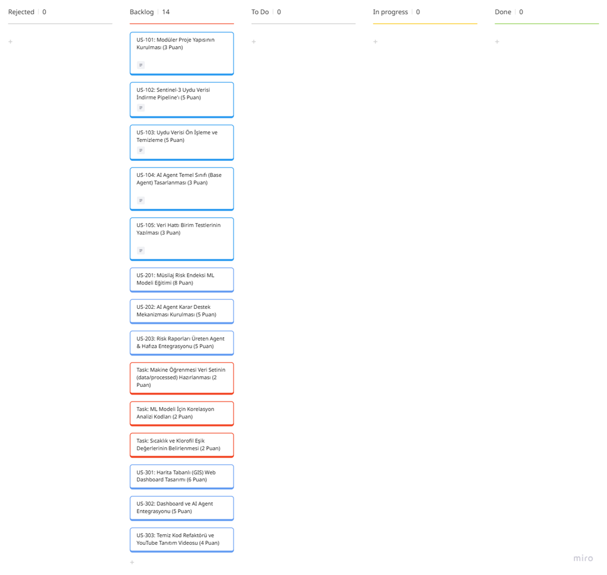
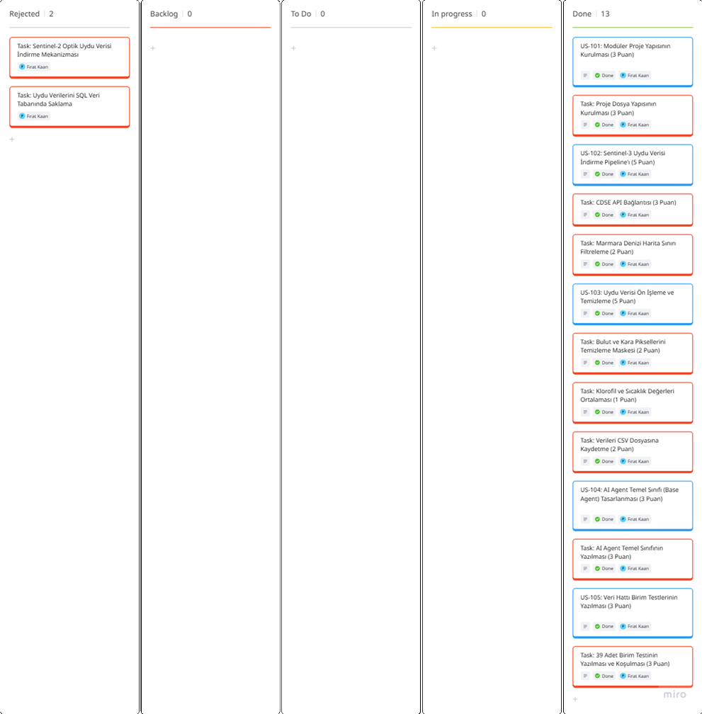

# **Takım İsmi**

Takım 48

# Ürün İle İlgili Bilgiler

## Takım Elemanları

- Samet Özkök: Product Owner ([LinkedIn](#) | [GitHub](https://github.com/sametozkok))
- Betül Danışmaz: Scrum Master ([LinkedIn](#) | [GitHub](https://github.com/betuldanismaz))
- Fırat Kaan Çıkar: Team Member/Developer ([LinkedIn](https://www.linkedin.com/in/fkaancikar) | [GitHub](https://github.com/fkaanc))
- Selma Bener: Team Member/Developer ([LinkedIn](#) | [GitHub](https://github.com/selmaabe))
- Ahmet Yasir Duman: Team Member/Developer ([LinkedIn](https://www.linkedin.com/in/ahmet-yasir-duman-03b689256) | [GitHub](https://github.com/ahmetduman23))

## Ürün İsmi

--AquaSentinel AI--

## Ürün Açıklaması

- AquaSentinel AI, Marmara Denizi'ndeki müsilaj oluşumunu yapay zeka ve uydu verileriyle erken tespit eden bir uyarı sistemidir. Deniz yüzeyi sıcaklığı (SST) ve klorofil-a verilerini otomatik olarak toplayıp analiz ederek risk tahmini yapar ve yetkilileri uyarır.

## Ürün Özellikleri

- Sentinel-3 uydu verilerini otomatik indirme (CDSE API)
- Bulut, kara ve hatalı veri maskeleme (Kalite Kontrol)
- Klorofil-a ve Deniz Yüzeyi Sıcaklığı (SST) zaman serisi verisi oluşturma
- Otomatik trend analizi grafikleri üretme

## Hedef Kitle

- Çevre, Şehircilik ve İklim Değişikliği Bakanlığı
- Belediyelerin çevre ve denizcilik birimleri
- Denizcilik ve balıkçılık sektörü
- Deniz bilimleri araştırmacıları ve akademisyenler

## Product Backlog URL

[Miro Backlog Board](https://miro.com/app/board/uXjVH7tYdQM=/?share_link_id=616030223380)

---

# Sprint 1

**Backlog düzeni ve Story seçimleri**: Backlog'umuz öncelikli işlere göre sıralanmıştır. Story'ler, sprint kapasitesini aşmayacak şekilde seçilmiş ve daha küçük alt görevlere (task) bölünmüştür. Miro panosunda mavi kartlar story'leri, turuncu kartlar ise görevleri temsil eder.

**Puanlama Mantığı**: Sprint 1 toplam eforu 19 SP (Story Point) olarak planlanıp tamamlanmıştır. Puanlar iş yüküne göre verilmiştir:
- Yüksek eforlu işler (CDSE API entegrasyonu, veri ön işleme): **5'er SP**
- Temel kurulum ve test işleri (Proje yapısı, Base Agent, birim testleri): **3'er SP**

**Reddedilen İşler (Rejected Backlog)**:
- **Sentinel-2 Verisi**: Bulutluluk oranı yüksek olduğu için yerine Sentinel-3 tercih edildi.
- **SQL Veritabanı**: İlk aşamada sistemin hafif ve hızlı olması için SQL yerine doğrudan `.csv` dosyaları kullanıldı.

**Sprint 1 Hedefi**: Marmara Denizi için Sentinel-3 uydu verilerini otomatik indiren, hatalı ve bulutlu pikselleri temizleyen ve zaman serisi veri seti oluşturan altyapının kurulması.

**Sprint 1 User Stories**:
- **US-101 (3 SP)**: Modüler proje klasör yapısının (`src/`, `tests/`) kurulması. (✅ Done)
- **US-102 (5 SP)**: Sentinel-3 uydu verisi indirme modülünün geliştirilmesi. (✅ Done)
- **US-103 (5 SP)**: Bulut/kara maskeleme ve veri temizleme modülünün yazılması. (✅ Done)
- **US-104 (3 SP)**: AI Agent temel (Base Agent) sınıfının oluşturulması. (✅ Done)
- **US-105 (3 SP)**: Veri akışı için en az 39 adet birim testinin yazılması. (✅ Done)

**Sprint Backlog Tablosu**: 

- **Daily Scrum**: Mezuniyet, bitirme projesi ve staj yoğunlukları nedeniyle görüşmelerimiz WhatsApp üzerinden yazılı olarak yapılmıştır. 

- **Sprint board update**: Sprint 1 sonundaki tüm görevlerin tamamlandığını gösteren panomuz:

- **Ürün Durumu**: Sentinel-3 verilerini otomatik indiren veri akışı kuruldu. Ham veriler bulut ve karadan temizlenerek `marmara_time_series.csv` dosyasına kaydedildi. Ayrıca `src/visualization.py` ile bu verilerin otomatik trend grafiği üretildi.

- **Sprint Review**: Veri indirme, maskeleme, temizleme modülleri ile AI Agent iskelet yapısının çalıştığı doğrulandı. Hazırlanan zaman serisi veri setinin Sprint 2'de eğitilecek yapay zeka modeline beslenmesine karar verildi.

- **Sprint Retrospective**: Yoğun takvimimize rağmen hedeflerimize ulaştık. API indirme süreci yavaş olduğundan sahte (mock) veri modu ekleyerek testleri hızlandırdık. Gelecek sprintte işleri zamana daha dengeli yaymayı ve haftada 1-2 kez kısa canlı toplantı yapmayı kararlaştırdık.

---

# Sprint 2

- **Backlog düzeni ve Story seçimleri**: 
- **Daily Scrum**: 
- **Sprint board update**: 
- **Ürün Durumu**: 
- **Sprint Review**: 
- **Sprint Retrospective**: 

---

# Sprint 3

- **Backlog düzeni ve Story seçimleri**: 
- **Daily Scrum**: 
- **Sprint board update**: 
- **Ürün Durumu**: 
- **Sprint Review**: 
- **Sprint Retrospective**: 
